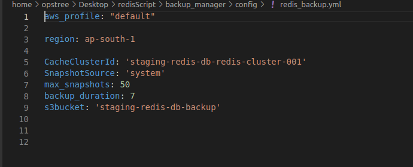
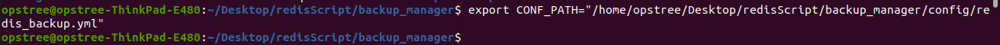
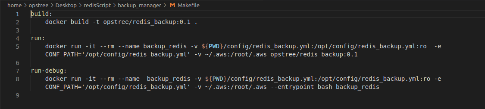
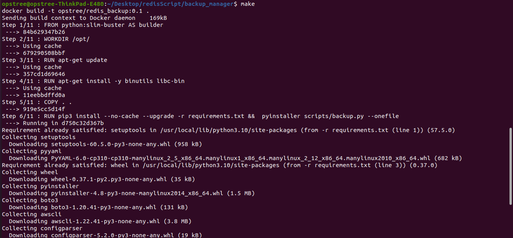

# Schedule backup Utility
This utility will fetch automatic/User created backups of the AWS resources by the user-defined tags or resource id, resources like redis and RDS. And it can be used to schedule push backups to S3 bucket . 
## configuration 
Here configuration file where arugments are given in key=value  :
- ***profile :*** It is a credentials that you can apply to a AWS CLI command.It is optional argument . 
- ***aws_region :*** The AWS Region where the this utility  is executed.It is a required argument.
- ***elasticache_backup_conf :**** This utility will fetch all the elasticcache backup matches to this given Cache_cluster, ***SnapshotSource will filter snapshots user created or the automated backup, ***max_snapshots: will list upto 50 snapshots, ***backup_duration: will filter the snapshots of as last 1 day or last month,***s3bucket: Name of the bucket where we want to push backups.




## From Local
To run this utility locally from your system. Follow below steps.
- Clone this repo link.
- Make changes to configuration files as required i.e config/redis_backup.yml.
- Export two environment variables .
   - ***CONF_PATH:*** Path of the configuration file.
   

  


- Run the python script.

``` python3 backup.py```

## Using Docker
To run this utility using docker.Follow below steps.
- Clone this repo.
- Make changes to configuration files as required i.e config/schedule_ec2.yml.
- Then do some  changes in Makefile i.e set the path of configuration file (CONF_PATH).



- Execute the ***make*** command . 




 
